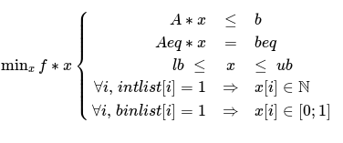

 SolveEngine
===========
Python library for Solve Engine

### **HOW TO INSTALL THE LIBRARY**

 **Using pip**
 
 - From you console, call this :
```
pip install solveengine
```
 - Or for python3 users :
```
pip3 install solveengine
```

 **By directly downloading github repository** 
 - Open the folder in the console and use this command :
```
python setup.py install
```
 - Or for python3 users :
```
python3 setup.py install
```

**If the external modules did not install correctly:**
 Download the folder directly from github, get the path for the file requirements.txt and use:
```
pip install -r '/path/to/requirements.txt'
```

**Avoid having grpc as python module installed**

Instead, install grpcio
SolveEngine will crash with grpc, given that this module is not complete and could mislead python

### **MAIN METHODS**
#### **Models** 
- Print the examples for building the models
-- print(help_sat())
-- print(help_mip())
- Open a new MIP model
-- model = MIPModel(token, filename, sleep_time, debug, interactive_mode, http_mode)
- Open a new SAT model
--model = SATModel(token, filename, sleep_time, debug, interactive_mode, http_mode)

#### **Model initialising inputs**
- **token**, str:
   - the api key you can find at this url after logging in : https://solve.satalia.com/api. It will be used to recognise the user for solving the problem
- **filename**, str:
   - The name the model will have on your Solve Engine dashboard
 - **sleep_time**, float, default=2:
- The number of seconds your programm will wait between each status request
- **debug**, boolean, default=False:
   - If true, the debugger will print information for each step
- **interactive_mode**, boolean, default=False:
   - If true, will print basic updates about the solving of the problem
- **http_mode**, boolean, default=False:
   - If False, the requests will be sent using GRPC tehcnology, which is faster. If True, will send http requests

#
#### **Infinity**
- to set a MIP variable bound to be infinity, call:
   - ub = INF
   - lb = - INF

#

#### **Enums** 
-  **Solve engine solving status:**
   - SEStatusCode.NOTSTARTED = "notstarted"
   - QUEUED = "queued"
   - STARTED = "started"
   - STARTING = 'starting'
   - COMPLETED = 'completed'
   - STOPPED = 'stopped'
   - FAILED = 'failed'
   - INTERRUPTED = 'interrupted'
   - TIMEOUT = 'timeout'

 - **Solved problem status**
 - SovlerStatusCode.INTERRUPTED = "interrupted"
    - NOTSTARTED = "notstarted"
    - OPTIMAL = "optimal"
    - INFEASIBLE = "infeasible"
    - UNBOUNDED = "unbounded"
    - SATISFIABLE = "satisfiable"
    - UNSATISFIABLE = "unsatisfiable"

 - **Direction, used for MIP models:**
    - Direction.MAXIMIZE = "Maximize"
    - MINIMIZE = "Minimize"

### **MIP Example**
This file presents how to create a MIPModel, add variables, add constraints and solve the model using the SolveEngine python interface
```
from pysolveengine import MIPModel, INF, Direction, SEStatusCode, SolverStatusCode
```
 #### **Create MIP model**

 - *The token (personnal key that can be found at solve.satalia.com)*
 ```
 token = "2prMEegqCAFndnvjVdnXmGufyJ+PcMzJbZaQcvqrhtxg="
 ```

 - *The name of the file being used when uploading the problem file (to be able to find the file in the webinterface of the SolveEngine more easily)*
 default: "model"
 ```
 model_name = "special_model"
 ```

 - *The time (in seconds) the model class waits before checking the server if the result is ready the smaller the number the shorter the intervals*
 ```
sleep_time = 3
 ```

 - *With/without debug printout this does not print debug information for the solvers*
 ```
debug = True
 ```

 - *if True, messages will be printed to keep updated on the status of the solving*
 ```
 interactive_mode = True
 ```

 - *web connection works by default with grpc, which is faster if http connections desired set it to True*
 ```
 http_mode = False
 ```

 Finally :
 ```
 model = MIPModel(token, model_name=model_name, sleep_time=sleep_time, debug=debug, interactive_mode=interactive_mode,http_mode=http_mode)
 ```

#### Two ways to set the objective direction of the model
```
model.set_to_minimize()
```
#### or
```
model.set_direction(Direction.MINIMIZE)
```

#### **BUILDING STEP BY STEP**
 - **Creating Variables**
    - *For all methods we have the default bounds:*
 ```
 lb = -INF
 ub = INF
 ```

 - *Binary variable*
```
x1 = model.add_binary_var(name="x1")
x2 = model.add_binary_var("x2")
```

 - *Integer variable, note that for y1, ub=INF is set by default*
```
y1 = model.add_integer_var(name="y1", lb=-13)
y2 = model.add_integer_var(name="y2", lb=-13, ub=INF)
```

 - *Continuous variable, note that for z2, lb=-INF is set by default*
```
z1 = model.add_continuous_var("z2", ub=23)
z2 = model.add_continuous_var("z3", lb=-INF, ub=23)
```

 - *If a variable you added is lost in your code, you can get it back with get_variable()*
```
z1 = model.get_variable("z1")
```

 - *Change / print bounds*
```
z1.lb = 12
z1.ub = 34
print("z1 lb=", z1.lb)
print("z1 ub=", z1.ub)
```

 - *Print name*
```
print("z1 name=", z1.name)
```

- **Creating expressions**
 - *Building linear expression*
```
expr = 2*x1 + 3*y1 + z1 + 4
```

 - *Print expression*
```
print("expr=", expr)
print("expr=", str(expr))
```

 - *Check if expr is constant*
```
print("expr is constant?", expr.is_constant) # False
```

 - *Check if two expr are equal on a semantic level*
```
expr2 = 2*x1 + z1 + 4 + 2*y1 + y1
print("expr equals expr2?", expr.equals(expr2)) # True
```

 - *Modify expression*
```
expr -= x1
expr += x2
expr *= 3
```

 - *Create constraint using <=, == or >=*
```
constr1 = expr <= x2 + 4*z3 - 5
```

 - *Add constraints to model, the name is optional*
```
model.add_constraint(constr1, name="some constraint")
model.add_constraint(y1 >= -12 + y2)
model.add_constraint(x1 == z2 + 4)
```

 - **Setting objective**, the objective is an expression
```
model.set_obj(expr + 12*y2)
```

#
#### **BUILDING MODEL WITH MATRICES (LIKE MATLAB)**
This way will reset the model and build it using matrices following this syntax :

   - **f, b, beq, lb, ub** : lists of real numbers

   - **A, Aeq**: matrices of real numbers

   - **int_list, bin_list**: lists of 0 or 1

such that it matches with this model



- **Optional:**
```
import numpy as np
```

- **Set the matrices**
  - *objective function*
```
   f = [-2,1,3]
```
*or*
```
   f = np.array([-2, 1, 3])
```

   - *Inequality constraints coefficients: left side*
```
   A = np.array([[2, 3, 1], [-1, 0, 4]])
```
*or*
```
   A = [[2, 3, 1], [-1, 0, 4]]
```

   - *Inequality constraints coefficients: right side*
```
   b = [1, 0]
```

   - **Optional:** *equality constraints coefficients : left and right sides*
```
   Aeq = [[1, 5, 0]]
   beq = [- 2.5]
```

   - **Optional:** *Lower and upper bounds*
```
   lb = [-INF, 1, -1]
   ub = [5, 10, INF]
```

   - **Optional:** *List of integer/binary variables, 1 for integer/binary, 0 for continuous. In case of conflict with bounds, binary has priority*
```
   int_list = [0, 0, 1]
   bin_list = [1, 0, 0]
```

- *These inputs can as well be classes that return something with respectively [i][j] and [i]*

    *All the values returned must be callable in float()*
- **Reset the model and set it using these matrices**
```
model.build_with_matrices(f, A, b, 
    Aeq=[Aeq], beq=[beq],
    lb=[lb], ub=[ub],
    int_list=[int_list], bin_list=[bin_list]) 
```

#### **Check the model**
- print(model.build_str_model())
- print(model.file_name)
- *You can know the index for each constraint by printing them*
```
model.print_constraints()
```

- *You can remove constraint knowing its index*
```
model.remove_constraint_with_index(index=-1)
```

#
#### **Solving the model**
```
model.solve()
```

#
#### **Checking the results**
- **There are two different status values**
   - *print SolveEngine status*
```
    print("status=", model.se_status)
```
   - *print solved model status*

```
    print("solver status:", model.solver_status)
```

- **To get the result :**

```
if model.se_status == SEStatusCode.COMPLETED:

    # print solver status
    print("solver status:", model.solver_status)

    # status codes with solution
    if model.solver_status in [SolverStatusCode.OPTIMAL]:

        # print obj value
        print("obj=", model.obj)

        # print variable values
        print("x1=", x1.value)
        print("x2=", x2.value)
        print("y1=", y1.value)
        print("y2=", y2.value)
        print("z1=", z1.value)
        print("z2=", z2.value)
        print("z3=", z3.value)
        
        #or
        for key, value in model.variables:
            print(key, "=", value)
            
        #print summary
        model.print_results()

    #status codes without solution
    if model.solver_status in [SolverStatusCode.INFEASIBLE, SolverStatusCode.UNBOUNDED]:
        print("the solver did not return a solution")

# status codes for an unsuccessful run
if model.se_status in [SEStatusCode.FAILED,
                       SEStatusCode.STOPPED,
                       SolverStatusCode.INTERRUPTED]:
    print("something went wrong")
if model.se_status in [SEStatusCode.TIMEOUT]:
    print("time limit has been reached")
```
### **SAT Example**
This file presents how to create a SATModel, add variables, add constraints and solve the model using the SolveEngine python interface
```
from pysolveengine import SATModel, SEStatusCode, SolverStatusCode
```
#### **Create SAT model**
- *The token (personnal key that can be found at solve.satalia.com*
```
token = "2prMEegqCAFndnvjVdnXmGufyJ+PcMzJbZaQcvqrhtxg="
```

- *The name of the file being used when uploading the problem file (to be able to find the file in the webinterface of the SolveEngine more easily)*

    default: "model"
```
model_name = "special_model"
```

- *The time (in seconds) the model class waits before checking the server if the result is ready the smaller the number the shorter the intervals*
```
sleep_time = 3
```

- *With/without debug printout this does not print debug information for the solvers*
```
debug = True
```

- *if True, messages will be printed to keep updated on the status of the solving*
```
interactive_mode = True
```

- *web connection works by default with grpc, which is faster if http connections desired set it to True*
```
 http_mode = False
```

```
model = SATModel(token, model_name=model_name,
    sleep_time=sleep_time, debug=debug,
    interactive_mode=interactive_mode,http_mode=http_mode)
```
#### **BUILDING STEP BY STEP**
- **Creating Variables**
*an integer id is automatically given to each variable, the id by default will be the smallest available integer*
```
x1 = model.add_variable("x1")
x2 = model.add_variable("x2")
```

- *You can define an id yourself, but it is not advised*
```
x3 = model.add_variable("x3", id_=3)
```

- **If a variable is lost in your code, you can use:**
```
x3 = model.get_variable_with_id(id_=3)
```

or
```
x3 = model.get_variable_with_name(name="x3")
```

- **Building expressions**
 *-x1 means negative(x1)*
*when expression displayed, will show !x1*
```
expr = -x1
```

 *'|' is used for 'OR'; & is used for 'AND'*
```
expr = (x1 | x2) & x3
```

*^ is used for 'XOR'  (equivalent to (x1 | x2) & -(x1 & x2)*
```
expr = x1 ^ x2
```

*(==, !=, <=) are used to express equivalence, non equivalence and implication*
```
expr = (x1 == x2) <= (x1 != x3)
```

- **Add constraint**
```
model.add_constraint_expr(expr)
```

#
#### **BUILDING WITH A LIST**
This way will reset the model and build it using matrices/list of lists
 This way uses only the integer ids
 You cannot use the id 0
 No need to build the variables first, hey will be automatically added to the model with a generated name

- *Add a constraint (only linked by 'OR')  (equivalent to : x1 | -x5 | x2)*
```
model.add_constraint_vector([1, -5, 2])
```

- *You can also add several constraints in once*
*there can be expression as well as vectors*
```
lst_constraints = []
lst_constraints.append([1, -2, 5])
lst_constraints.append(expr)
model.add_list_constraints(lst_constraints=lst_constraints)
```

#
#### **BUILDING WITH A FILE**
You can also easily build the model using a file
The file must contained a problem written in a cnf format, starting with p cnf
```
file_path = '/.../filename.cnf'
model.build_from_file(file_path=file_path)
```

#
### **Check the model**
```
print(model.build_str_model())
print(model.file_name)
```
 You can know the index for each constraint by printing them
```
model.print_constraints()
```
You can remove constraint knowing its index
```
model.remove_constraint_with_index(index=-1)
```
#### **Solving the model**
```
model.solve()
```
#
#### **Checking the results**
- **There are two different status values**
   - *print SolveEngine status*
```
print("status=", model.se_status)
```

   - *print solved model status*
```
print("solver status:", model.solver_status)
```

- **To get the result :**

```
#if solve was successful
if model.se_status == SEStatusCode.COMPLETED:

    # print solver status
    print("solver status:", model.solver_status)

    # status codes with solution
    if model.solver_status in [SolverStatusCode.SATISFIABLE]:

        # print variable values : 1 if True, -1 if False
        print("x1=", x1.value)
        #or
        print("x1=", model.var_results[1])
        #or
        print("x1=", model.var_name_results["x1"])        

        #or
        for key, value in model.var_name_results.items():
            print(key, "=", value)

        #or
        #print summary
        model.print_results()

    # status codes without solution
    elif model.solver_status in [SolverStatusCode.UNSATISFIABLE]:
        print("the solver returned that the problem is unsatisfiable")

# status codes for an unsuccessful run
if model.se_status in [SEStatusCode.FAILED, SEStatusCode.STOPPED, SolverStatusCode.INTERRUPTED]:
    print("something went wrong")
if model.se_status in [SEStatusCode.TIMEOUT]:
    print("time limit has been reached")
```


